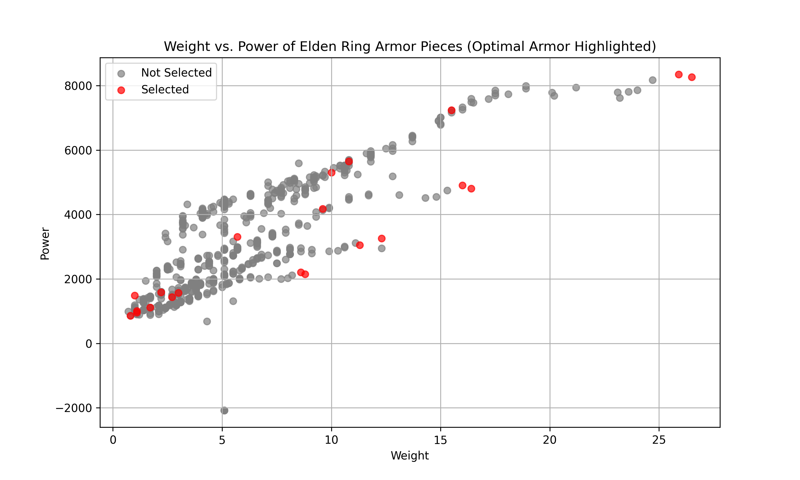

# Elden Ring Armor Optimization
Finding the optimal armor set combinations in Elden Ring using multi-criteria optimization with various goals:

## Motivation
My goal in this study was to answer a question never before mathematically solved: What are the truly best/most optimal armor combinations in Elden Ring?
Elden Ring, the 2022 "Game of the Year" winner, alongside its 2024 expansion "Shadow of the Erdtree," has 708 different armor pieces. Most armor in the game is collected in sets of 4 pieces (corresponding to the 4 slots: Helm, Chest, Gauntlets, Legs).
However, there are no set bonuses and no inherent advantages to keeping sets 'together.' This points to a flaw in past community efforts for determining the best armor, as they have almost always solely considered full sets.
Using data originally compiled by eldenring.wiki.fextralife.com of armor attributes viewable in game, I set out to find Elden Ring's best possible armor combinations.

## Methodology

### Data Cleaning and Feature Creation
The data, as I downloaded it, has significant flaws that I fixed in this order in clean.py:
- Most importantly, use mapping to parse and extract key features from "damage negation" and "resistance" fields, which are in key-value pair dictionary lists.
- Scale these important attributes from 0-100 where 100 is the best-in-class for a stat (as nominal values are not truly relevant or co-meaningful).
- Drop armor sets not obtainable in the game (only existing in game files).
- Create "power" column, a major feature in this study (described below).
- Drop and rename columns for clarity.

To create the power column, I first considered what factors were truly significant:
- Weight: higher-weight armor requires leveling Endurance, diverting levels away from other important stats.
- Poise: this determines how many hits you can take without getting staggered; this is important as getting staggered can lead to hit-chaining and death.
  - With 11 poise, you can withstand a projectile; with 51 poise, you can withstand most small enemies' attacks; you need 101 poise to withstand a large enemy's attack, which is unreachable through armor alone.
  - With that said, I consider 51 poise to be necessary with no additional benefit to higher values.
- All damage negation stats and all infliction resistance stats, which control how much damage you negate by enemy damage type and how long it takes for negative status effects to build-up on you, respectively, but there are a total of 12 of those.
- Special effects, but I will not be considering those as they are situational and only benefit certain builds.

Considering this, it became clear that the features of interest were weight, poise, and a yet-to-be created synthesis of the damage negation and infliction resistance stats.

To create this synthesized variable, power, I considered the main challenge of the game and where armor matters most, remembrance (main) bosses. In Elden Ring, there are 26 main bosses, each dealing certain damage types and inflictions. As different damage types and inflictions occur at different frequencies, it should be considered that resistance to more common damage types and inflictions is more important. I therefore compiled the table below:

| Main Boss                     | Damage Types                               | Inflictions  |
|--------------------------------|------------------------------------------|--------------|
| Godrick the Grafted           | standard, strike, fire                   |              |
| Rennala, Queen of the Full Moon | standard, magic, fire                    |              |
| Starscourge Radahn            | standard, pierce, magic                   |              |
| Regal Ancestor Spirit         | standard, magic                           |              |
| Morgott, the Omen King        | slash, pierce, holy, fire                 | bleed        |
| Astel, Naturalborn of the Void | standard, magic                           |              |
| Rykard, Lord of Blasphemy     | standard, fire, pierce                    | poison       |
| Lichdragon Fortissax          | standard, fire, lightning                 | death blight |
| Fire Giant                    | standard, strike, fire                    |              |
| Mohg, Lord of Blood           | standard, pierce, fire                    | bleed        |
| Maliketh, the Black Blade     | standard, slash, pierce, magic, holy      |              |
| Dragonlord Placidusax         | standard, fire, lightning                 |              |
| Hoarah Loux, Warrior          | standard, strike                          |              |
| Malenia, Blade of Miquella    | standard, slash, pierce, holy             | scarlet rot  |
| Elden Beast                   | standard, holy                            |              |
| Divine Beast Dancing Lion     | standard, strike, magic, lightning        | frostbite    |
| Rellana, Twin Moon Knight     | standard, slash, pierce, magic, fire      |              |
| Putrescent Knight             | standard, slash, magic                    | frostbite    |
| Commander Gaius               | standard, slash, strike, pierce, magic    |              |
| Scadutree Avatar              | standard, strike, magic, holy             | bleed        |
| Messmer the Impaler           | standard, slash, strike, pierce, fire     |              |
| Romina, Saint of the Bud      | standard, slash, strike, pierce           | scarlet rot  |
| Metyr, Mother of Fingers      | standard, slash, strike, magic, holy      |              |
| Midra, Lord of Frenzied Flame | standard, pierce, fire, holy              | madness      |
| Bayle the Dread               | standard, fire, lightning                 |              |
| Radahn, Consort of Miquella   | standard, pierce, magic, fire, holy       | bleed        |

Stats affecting infliction resistances map to the inflictions as shown below:
robustness: bleed and frostbite; immunity: scarlet rot and poison; vitality: death blight; focus: madness.

Considering frequency of type/infliction amongst main bosses as a pure coefficient multiplier of importance, we get the table below:

| Type/Infliction | Importance Multiplier |
|-----------------|----------------------|
| standard        | 26                   |
| fire           | 10                   |
| magic         | 10                   |
| pierce        | 8                    |
| strike        | 8                    |
| holy         | 7                    |
| slash        | 7                    |
| robustness    | 6                    |
| lightning    | 5                    |
| immunity      | 3                    |
| focus        | 1                    |
| vitality      | 1                    |

Thus, the calculation for armor piece power is below (remember, input features are scaled values):

Power = 26 × Physical + 10 × Fire + 10 × Magic + 8 × Pierce + 8 × Strike + 7 × Holy + 7 × Slash + 6 × Robustness + 5 × Lightning + 3 × Immunity + Focus + Vitality

### Defining and Implementing Methods

As there is no one best armor combination for all players, I defined 3 methods for determining the best possible armor set and ran each for the full game and for the base game only, resulting in 6 different mathematically derived answers. I considered common motivations to devise these methods (note: these do not give special consideration to PvP players, who may need higher poise).

Method 1. Lowest weight combination with 51+ poise: This is for minimizing stat investment while being able to withstand standard hits (good for low levels).

Method 2. Highest total power combination with 51+ poise: This finds the best armor combination in the game if weight is no issue (good for very high levels).

Method 3. Best total power/weight ratio of 4-piece combinations with 51+ poise (most optimal defensive return on level spend).

As the total number of combinations of armor is a large search space, greedy search algorithms were considered, but I rightly expected heuristics to fail so instead built an optimized brute-force method. One counterintuitive example of heuristic failure includes one piece from the Method 1 winner barely being in the top-half of poise/weight ratio pieces, where poise/weight seems like the clear heuristic for finding the minimum weight for 51 poise (which has in-fact been used to find non-optimal combinations by community members previously).

For Method 1, I generated every combination of 2 or more pieces (as you need at least 2 pieces for 51 poise), iterated through every combination, checked if the poise requirement was met, and logged it if it was the lowest weight yet or in a tie for the same. This had surprisingly fast run time of 11 minutes for the full game (with a 2-way tie) and 4 minutes for the base game (with a 3-way tie).

For Method 2, the simplest method was to simply check if the highest-power piece for each slot happened to combine for at least 51 poise. It does, as poise, weight, and power are heavily correlated (as in, high weight pieces tend to have high poise and power)—correlation matrix shown below. However, as an alternative, I also wrote the code to handle cases in which the highest power combination didn't have 51+ poise, with both approaches having near-instant runtimes.

|         | weight   | poise    | power    |
|---------|---------|---------|---------|
| weight | 1.000000 | 0.972875 | 0.847949 |
| poise  | 0.972875 | 1.000000 | 0.902007 |
| power  | 0.847949 | 0.902007 | 1.000000 |

For Method 3, I am only considering 4-piece combinations, but it is still the highest complexity. After generating all combinations, we must sum the weights, poise, and power within each  combination, check if poise >=51, find the power/weight ratio, and log it. When I removed unobtainable armor pieces and pieces with negative power scores (which do exist for a few pieces with negative stats), runtime was improved by 12%. These ran in 156 minutes for the whole game and 58 minutes for the base game. This is a long run-time and could be slightly improved with step reordering but checking the full search space was essential for avoiding sub-optimal results.

## Results

**Method 1**, "Lowest weight combination with 51+ poise," found these optimal results for the full game (descending by total power for tiebreaker):

| Name                              | Slot       | Weight | Poise | Power     | Special |
|-----------------------------------|-----------|--------|-------|-----------|---------|
| Circlet of Light                 | Helm      | 1.0    | 5     | 1,483.97  | +1 to Intelligence, Faith, and Arcane. Boosts the power of Miquella's Light |
| Fingerprint Armor (Altered)       | Chest     | 10.0   | 24    | 5,300.06  |         |
| Ascetic's Wrist Guards            | Gauntlets | 1.1    | 2     | 1,004.49  |         |
| Crucible Greaves                  | Legs      | 9.6    | 20    | 4,172.75  | 3.5% damage increase to Aspect of the Crucible Incantations |
| Total                         |           | 21.7   | 51    | 11,961.27 |         |

AND

| Name                              | Slot       | Weight | Poise | Power     | Special |
|-----------------------------------|-----------|--------|-------|-----------|---------|
| Circlet of Light                 | Helm      | 1.0    | 5     | 1,483.97  | +1 to Intelligence, Faith, and Arcane. Boosts the power of Miquella's Light |
| Fingerprint Armor (Altered)       | Chest     | 10.0   | 24    | 5,300.06  |         |
| Battlemage Manchettes             | Gauntlets | 1.1    | 2     | 956.80    |         |
| Crucible Greaves                  | Legs      | 9.6    | 20    | 4,172.75  | 3.5% damage increase to Aspect of the Crucible Incantations |
| Total                         |           | 21.7   | 51    | 11,913.58 |         |

---

These are the Method 1 optimal results for the base game (descending by total power for tiebreaker):

| Name                              | Slot       | Weight | Poise | Power     | Special |
|-----------------------------------|-----------|--------|-------|-----------|---------|
| Omensmirk Mask                    | Helm      | 3.0    | 6     | 1,572.71  | +2 Strength |
| Fingerprint Armor (Altered)       | Chest     | 10.0   | 24    | 5,300.06  |         |
| Gold Bracelets                    | Gauntlets | 0.8    | 1     | 857.78    |         |
| Crucible Greaves                  | Legs      | 9.6    | 20    | 4,172.75  | 3.5% damage increase to Aspect of the Crucible Incantations |
| Total                         |           | 23.4   | 51    | 11,903.30 |         |

AND

| Name                              | Slot       | Weight | Poise | Power     | Special |
|-----------------------------------|-----------|--------|-------|-----------|---------|
| Champion Headband                 | Helm      | 2.7    | 5     | 1,437.96  |         |
| Fingerprint Armor (Altered)       | Chest     | 10.0   | 24    | 5,300.06  |         |
| Battlemage Manchettes             | Gauntlets | 1.1    | 2     | 956.80    |         |
| Crucible Greaves                  | Legs      | 9.6    | 20    | 4,172.75  | 3.5% damage increase to Aspect of the Crucible Incantations |
| Total                         |           | 23.4   | 51    | 11,867.57 |         |

AND

| Name                              | Slot       | Weight | Poise | Power     | Special |
|-----------------------------------|-----------|--------|-------|-----------|---------|
| Omensmirk Mask                    | Helm      | 3.0    | 6     | 1,572.71  | +2 Strength |
| Mausoleum Knight Armor (Altered)  | Chest     | 10.8   | 25    | 5,651.07  |         |
| None                              |           |        |       |           |         |
| Crucible Greaves                  | Legs      | 9.6    | 20    | 4,172.75  | 3.5% damage increase to Aspect of the Crucible Incantations |
| Total                         |           | 23.4   | 51    | 11,396.53 |         |

---

**Method 2**, "Highest total power combination with 51+ poise," found this optimal result for the full game:

| Name                    | Slot       | Weight | Poise | Power     | Special |
|-------------------------|-----------|--------|-------|-----------|---------|
| Greatjar               | Helm      | 12.3   | 14    | 3,257.04  | Increases the power of all thrown pots by 16% |
| Verdigris Armor        | Chest     | 25.9   | 47    | 8,347.99  |         |
| Verdigris Gauntlets    | Gauntlets | 8.6    | 10    | 2,203.98  |         |
| Verdigris Greaves      | Legs      | 16.0   | 28    | 4,907.38  |         |
| Total              |           | 62.8   | 99    | 18,716.39 |         |

---

This is the Method 2 optimal result for the base game (this is the only optimal result with a full set):

| Name                    | Slot       | Weight | Poise | Power     | Special |
|-------------------------|-----------|--------|-------|-----------|---------|
| Bull-Goat Helm         | Helm      | 11.3   | 15    | 3,049.70  |         |
| Bull-Goat Armor        | Chest     | 26.5   | 47    | 8,262.50  |         |
| Bull-Goat Gauntlets    | Gauntlets | 8.8    | 10    | 2,149.51  |         |
| Bull-Goat Greaves      | Legs      | 16.4   | 28    | 4,808.24  |         |
| Total              |           | 63.0   | 100   | 18,269.95 |         |

---

**Method 3**, "Best total power/weight ratio of combinations with 51+ poise," found this optimal result for the full game:

| Name                    | Slot       | Weight | Poise | Power     | Special |
|-------------------------|-----------|--------|-------|-----------|---------|
| Circlet of Light       | Helm      | 1.0    | 5     | 1,483.97  | +1 to Intelligence, Faith, and Arcane. Boosts the power of Miquella's Light |
| Crucible Tree Armor    | Chest     | 15.5   | 33    | 7,239.90  | Strengthens Aspects of the Crucible incantations |
| Ascetic's Wrist Guards | Gauntlets | 1.1    | 2     | 1,004.49  |         |
| Ronin's Greaves        | Legs      | 5.7    | 11    | 3,308.03  |         |
| Total              |           | 23.3   | 51    | 13,036.39 |         |

---

This is the Method 3 optimal result for the base game:

| Name                    | Slot       | Weight | Poise | Power     | Special |
|-------------------------|-----------|--------|-------|-----------|---------|
| Marais Mask            | Helm      | 2.2    | 4     | 1,585.50  | +1 Arcane |
| Crucible Tree Armor    | Chest     | 15.5   | 33    | 7,239.90  | Strengthens Aspects of the Crucible incantations |
| Godskin Noble Bracelets | Gauntlets | 1.7    | 3     | 1,112.64  |         |
| Ronin's Greaves        | Legs      | 5.7    | 11    | 3,308.03  |         |
| Total              |           | 25.1   | 51    | 13,246.07 |         |

---

To better illustrate the relationship between weight and power, the scatter plot below shows all Elden Ring armor pieces, highlighting those selected by any of the 3 methods (full game or base game).

---

## Discussion

These results are very interesting:

Method 1 was able to find two 51 poise armor sets at only 21.7 weight units each. The main drawback of those combinations is that the helm is obtained from the final boss of the expansion. For the base game, there were 3 sets found with only 23.4 units each. These are exceptionally light. If you were to only consider full sets as in prior approaches, the lightest set with 51+ poise is 25.3 units (the Knight Set, which is admittedly considerably easier to obtain).

Method 2's yield, the Greatjar (helm) and Verdigris chest, gauntlets, and legs, is extremely powerful and no-doubt the best armor combination possible if weight is of no issue. However, this requires at least 40 Endurance (for a medium roll, meaning without reducing mobility). Method 2 for the base game was the only approach to return a full 'in-tact' set, the Bull-Goat set. This is also a very strong set but also requires at least 40 Endurance.

Method 3 is my favorite approach as it balances the need of high damage and infliction resistance with the need to minimize weight and also to have at least 51 poise. In the full game, we found Circlet of Light, Crucible Tree Armor, Ascetic's Wrist Guards, and Ronin's Greaves. For only 23.3 weight units, this is 69.7% as much power as the most powerful set in the game, while requiring as little as 0 Endurance investment. For the base game, we found Marais Mask, Crucible Tree Armor, Godskin Noble Bracelets, and Ronin's Greaves. For only 25.1 weight units, this is 72.5% as powerful as the most powerful base game combination, also requiring as little as 0 Endurance leveling rather than 40 Endurance.

The Elden Ring Wiki also took a stab at an approach similar to this (though their exact method was not outlined). Their finding is below (with an accompanying table showing the set's stats formatted as above):

"For a custom set of armor, the best armor for defenses, poise, and weight in ratio would be the Iron Helmet, Fingerprint Armor (Altered), Crucible Greaves, and Gold Bracelets."

| Name                     | Slot      | Weight | Poise | Power    | Special                                         |
|--------------------------|----------|--------|-------|----------|-------------------------------------------------|
| Iron Helmet             | Helm     | 3.8    | 6     | 1,701.29 |                                                 |
| Fingerprint Armor (Altered) | Chest | 10.0   | 24    | 5,300.06 | Strengthens Aspects of the Crucible incantations |
| Gold Bracelets          | Gauntlets | 0.8    | 1     | 857.78   |                                                 |
| Crucible Greaves        | Legs      | 9.6    | 20    | 4,172.75 | 3.5% damage increase to Aspect of the Crucible Incantations |
|                          |          | 24.2 | 51 | 12,031.88 |                                             |

Our optimal result is not only 0.9 weight units lighter, but also 8.3% more powerful. Comparing the Wiki's set to our base game optimal set, we are 0.9 weight units heavier but 10.0% more powerful.

As outlined before, most prior approaches exclusively considered full sets. The most popular of these, a YouTube video with over 1.4 million views at the time of this writing, found the Tree Sentinel set to be #1 set in the game. That set's chart is below.

| Name                    | Slot      | Weight | Poise | Power    | Special |
|-------------------------|----------|--------|-------|----------|---------|
| Tree Sentinel Helm     | Helm     | 8.1    | 12    | 2,939.03 |         |
| Tree Sentinel Armor    | Chest    | 18.9   | 39    | 7,988.23 |         |
| Tree Sentinel Gauntlets | Gauntlets | 6.3    | 8     | 2,062.85 |         |
| Tree Sentinel Greaves  | Legs     | 11.7   | 23    | 4,635.19 |         |
|                         |          | 45 | 82 | 17,625.30 | |

Method 3's result is 21.7 units lighter while being 74.0% as powerful. While the two are hard to compare, I am fairly confident at least one of my 3 methods produces a better result for most players.

**With that said, we have successfully found the mathematically optimal armor combinations for lowest weight, no weight restriction, and a balanced approach, and for the full game and base game for each of the 3 approaches.**
